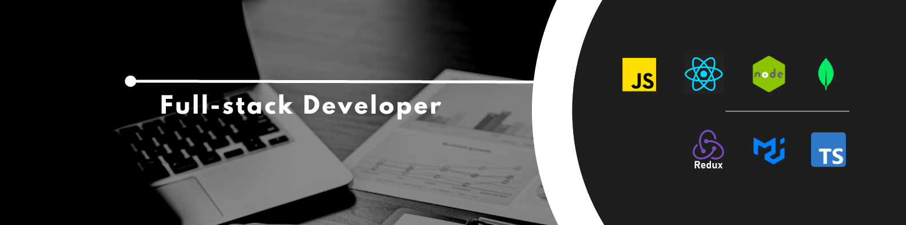

  

<h1 align="center">Hi, I'm Md. Amdadul Haque</h1>

## MERN Stack Web Developer

I'm a self driven web programmer with a passion for crafting dynamic and interactive web applications. With extensive experience in MongoDB, Express, React, and Node.js, I thrive on turning ideas into fully functional, user-friendly digital experiences. Whether it's building robust APIs, designing intuitive user interfaces, or optimizing database performance, I'm dedicated to delivering high-quality solutions that meet both user needs and business objectives.

<!-- 👨‍💻 All of my projects are available at my [Portfolio](https://your-portfolio-link.com) -->

📫 Email me at: [amdadulhaque.ier.du@gmail.com](mailto:amdadulhaque.ier.du@gmail.com)

<!-- 📄 Get My [Resume](https://your-resume-link.com) -->

<!-- 📄 And My [CV](https://your-cv-link.com) -->

:

🚀 My Web Development Skills
🖥️ Frontend

🛠️ Backend

🗃️ Database

🧠 Programming Languages

<!--  -->

